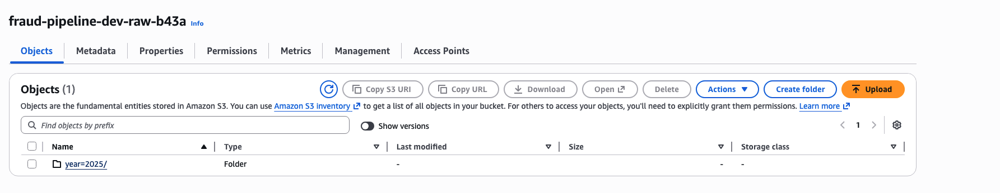
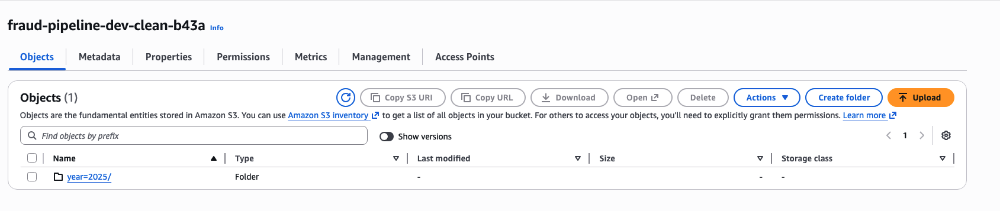
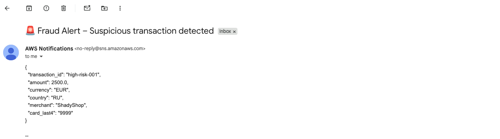

# Real-Time Fraud Detection Streaming Pipeline (AWS)

A real-time fraud detection pipeline on AWS using a streaming-first design.
The system ingests transaction events via HTTP, processes them through Kinesis, stores RAW and CLEAN data in S3, triggers real-time alerts, and enables analytics via Athena.
The design focuses on decoupling ingestion, storage, enrichment, and alerting to support scalability, replayability, and independent consumers.
---

## 🚀 High-Level Architecture

This project implements a real-time fraud detection pipeline on AWS using a streaming-first architecture.
Kinesis Data Streams act as the central event bus, allowing multiple consumers to process the same transaction events independently.

### Architecture Flow

1. **Ingestion Layer**
   - External systems send JSON transactions to a public `POST /transactions` endpoint.
   - API Gateway forwards requests to the Ingest Lambda.
   - The Ingest Lambda validates the payload and publishes valid events to Kinesis.
   - `card_last4` is used as the partition key to preserve ordering per card.

2. **Streaming Layer**
   - Kinesis Data Streams provide high-throughput, low-latency ingestion.
   - Multiple consumers read from the same stream without coupling.

3. **RAW Storage Layer**
   - A Firehose delivery stream writes unmodified events to the RAW S3 bucket.
   - Data is immutable and partitioned by `year/month/day/hour`.
   - This layer acts as the source of truth for replay and auditing.

4. **Transform & CLEAN Layer**
   - A second Firehose stream invokes a Transform Lambda.
   - The Lambda enriches events with `ingest_ts` and `is_high_risk`.
   - Enriched data is stored in the CLEAN S3 bucket using the same partitioning scheme.
   - This layer is optimized for analytics and downstream ML use cases.

5. **Alerts Layer**
   - An Alerts Lambda is subscribed directly to the Kinesis stream.
   - It applies simple fraud rules in real time.
   - Suspicious transactions trigger notifications via SNS email alerts.

6. **Analytics Layer**
   - Athena external tables are defined over both RAW and CLEAN buckets.
   - Partition projection is used to avoid manual partition management.
   - Enables fast querying for investigations and reporting.

---
---

### Add the region note (place it under Terraform section header)
```md
All resources are deployed in `eu-central-1`.

## 🏗️ Terraform (Infrastructure as Code)

All AWS resources for this project are provisioned with Terraform so the pipeline is reproducible end-to-end.

### Why this structure?

The Terraform code is split into multiple files by component (instead of one large `main.tf`) to keep the infrastructure easy to navigate and review:

- `providers.tf` / `variables.tf` / `outputs.tf`: global setup, inputs, outputs
- `iam_lambda.tf`: IAM roles and policies for Lambdas and Firehose
- `kinesis.tf`: Kinesis Data Stream (central event bus)
- `firehose.tf`: Firehose delivery streams for RAW and CLEAN
- `apigw_lambda.tf`: API Gateway and Ingest Lambda integration
- `alerts_lambda.tf`: Alerts Lambda, event source mapping, SNS
- `athena.tf`: Athena tables over RAW and CLEAN with partition projection

This layout makes it clear where each AWS component is defined and reduces merge conflicts when changing one part of the system.

### What Terraform creates

- **API Gateway** exposing `POST /transactions`
- **Lambda functions**
  - Ingest Lambda (validates and publishes to Kinesis)
  - Transform Lambda (Firehose processing and enrichment)
  - Alerts Lambda (fraud rules and SNS notifications)
- **Kinesis Data Stream** as the central stream
- **Two Firehose delivery streams**
  - RAW → S3 (unmodified events)
  - CLEAN → Transform Lambda → S3 (enriched events)
- **S3 buckets** for RAW and CLEAN zones
- **SNS topic and email subscription** for alerts
- **Athena external tables** with partition projection
- **IAM roles and policies** following least-privilege principles

### Key design decisions

- **Kinesis as the hub:** Firehose and Alerts Lambda consume the same stream independently.
- **RAW vs CLEAN separation:** RAW is immutable for audit and replay; CLEAN is analytics-ready.
- **Partition projection in Athena:** avoids `MSCK REPAIR` and manual partition handling.
- **Ordering per card:** `card_last4` ensures ordering within shards.

### Known problems / trade-offs

- **Partition key skew:** a single `card_last4` may overload a shard.
  - Improvement: composite or hashed partition keys.
- **Rule-based fraud detection:** intended as a baseline.
  - Improvement: add ML-based scoring or anomaly detection.
- **Storage cost:** RAW + CLEAN duplication increases cost.
  - Improvement: S3 lifecycle policies (e.g. RAW → Glacier).


## 🧪 Runtime Evidence

The pipeline was deployed and validated end-to-end on AWS.

**Proof of execution:**
- Real-time ingestion via API Gateway
- RAW events stored in S3 with time-based partitions
- CLEAN events enriched with `ingest_ts` and `is_high_risk`
- Fraud alerts delivered via SNS email

### Screenshots

**Architecture**


**RAW data lake (Firehose → S3)**


**CLEAN enriched events**


**Real-time fraud alert (SNS email)**

### How to deploy

### How to deploy

### How to deploy

```bash
cd terraform
terraform init
terraform plan
terraform apply

