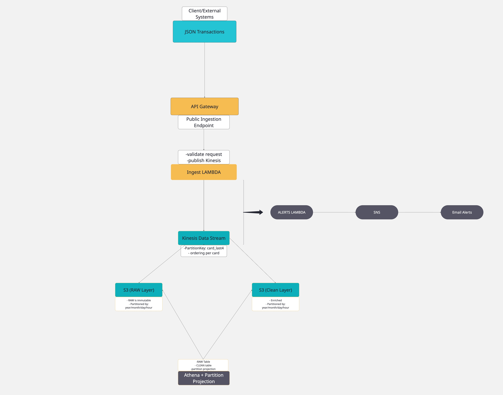

# Real-Time Fraud Detection Pipeline on AWS

A fully working **streaming fraud detection pipeline** built on AWS using **API Gateway, Lambda, Kinesis, Firehose, S3, Athena, SNS, and Terraform**.

It ingests transaction events via HTTP, streams them through Kinesis, stores them in a RAW and CLEAN data lake, runs real-time enrichment, and sends **email alerts** for suspicious transactions.

---

## 🚀 High-Level Architecture



**Flow:**

1. **API Gateway** exposes a public `POST /transactions` endpoint
2. **Ingest Lambda** validates JSON and publishes events to **Kinesis Data Stream**
3. **Kinesis** fans out data to:
   - **Firehose RAW → S3 (RAW zone)**
   - **Firehose CLEAN + Transform Lambda → S3 (CLEAN zone)**
   - **Alerts Lambda → SNS → Email alerts**
4. **Athena** queries both RAW and CLEAN layers for analytics and investigation

---

## ✨ Features

- Public **HTTP ingestion endpoint** (`POST /transactions`)
- **Schema validation** and clean HTTP responses
- **Real-time streaming** via Kinesis Data Stream
- **RAW data lake**: immutable, compressed JSON in S3
- **CLEAN data lake**: enriched, partitioned JSON in S3 (`year / month / day / hour`)
- **Enrichment Lambda**:
  - Adds `ingest_ts`
  - Adds `is_high_risk` flag via simple fraud rules
  - (Optionally) flattens nested `features`
- **Athena external tables** over RAW and CLEAN
- **Alerts Lambda**:
  - Reads from Kinesis
  - Applies fraud rules
  - Publishes alerts to SNS
- **SNS email alerts** for suspicious transactions
- Fully reproducible **Terraform** infrastructure

---

## 🧱 Architecture Layers

### 1. Ingestion Layer

- **API Gateway – `POST /transactions`**
  - Public endpoint for JSON transaction events
- **Ingest Lambda**
  - Validates required fields and types
  - Returns:
    - `202 Accepted` on success
    - `400` on validation error
    - `500` on unexpected error
  - Publishes valid events to **Kinesis Data Stream**
  - Uses `card_last4` as `PartitionKey` to keep same-card events ordered

### 2. Streaming Layer (Kinesis)

- **Kinesis Data Stream**
  - Real-time event bus for all transactions
  - High-throughput buffer between ingest and downstream consumers
  - Supports **multiple independent consumers**:
    - RAW Firehose → S3
    - CLEAN Firehose + Transform Lambda → S3
    - Alerts Lambda → SNS
  - Guarantees **ordering within a shard** for the same partition key

### 3. RAW Layer (Firehose → S3)

- **Firehose (RAW)**
  - Reads from Kinesis and writes unmodified events to S3
  - Output is compressed `.gz` JSON
- **S3 RAW Bucket**
  - Folder structure:
    ```text
    year=YYYY/month=MM/day=DD/hour=HH/
    ```
  - Immutable: never modified or deleted
  - Acts as **source of truth** for replay, auditing, debugging

### 4. Transform & CLEAN Layer

- **Transform Lambda**
  - Triggered via Firehose processing configuration
  - Decodes base64 Kinesis payload to JSON
  - Adds:
    - `ingest_ts`: when the event entered the pipeline
    - `is_high_risk`: simple rule-based fraud flag
  - Optionally flattens nested `features`
  - Returns enriched JSON back to Firehose

- **Firehose (CLEAN)**
  - Writes enriched events to the CLEAN S3 bucket
  - Same partitioning model:
    ```text
    year=YYYY/month=MM/day=DD/hour=HH/
    ```

- **S3 CLEAN Bucket**
  - Analytics-ready, enriched events
  - Ideal for Athena, BI, ML pipelines

### 5. Analytics Layer (Athena)

- **Athena RAW Table**
  - External table over RAW S3 bucket
  - Used for full-fidelity investigations and replay

- **Athena CLEAN Table**
  - External table over CLEAN S3 bucket
  - Includes `ingest_ts`, `is_high_risk`, and other enriched fields
  - Used for fraud analytics, dashboards, feature engineering

### 6. Alerts Layer (Real-Time Fraud Detection)

- **Alerts Lambda**
  - Subscribed directly to the Kinesis Data Stream via event source mapping
  - For each record:
    - Decodes Kinesis base64 payload → JSON
    - Applies fraud rules (e.g. high amount, risky country)
    - If suspicious → publishes alert to SNS

- **SNS Topic**
  - Sends email alerts to subscribed addresses
  - Example alert payload:
    ```json
    {
      "transaction_id": "high-risk-001",
      "amount": 2500.0,
      "currency": "EUR",
      "country": "RU",
      "merchant": "ShadyShop",
      "card_last4": "9999"
    }
    ```

---

## 🛠️ Tech Stack

- **Cloud**: AWS (eu-central-1)
- **Streaming**: Kinesis Data Streams, Kinesis Firehose
- **Compute**: AWS Lambda (Python 3.11)
- **Storage**: S3 (RAW + CLEAN buckets)
- **Query**: Athena
- **Alerts**: SNS (email)
- **Infra as Code**: Terraform
- **Language**: Python

---

## 📁 Repository Structure

```text
fraud-pipeline/
│
├── terraform/
│   ├── providers.tf
│   ├── variables.tf
│   ├── iam_lambda.tf
│   ├── kinesis.tf
│   ├── firehose.tf
│   ├── apigw_lambda.tf
│   ├── athena.tf
│   ├── alerts_lambda.tf
│   ├── outputs.tf
│   └── ...
│
├── lambdas/
│   ├── ingest_handler/
│   │   ├── app.py
│   │   └── requirements.txt
│   │
│   ├── transform_handler/
│   │   ├── app.py
│   │   └── requirements.txt
│   │
│   └── alert_handler/
│       ├── app.py
│       └── requirements.txt
│
├── sample_events/
│   ├── transaction.json
│   ├── high_risk_tx.json
│   └── ...
│
├── docs/
│   └── architecture.png        # architecture diagram
│
├── .gitignore
├── Makefile                    # optional helpers
├── README.md
└── LICENSE (optional)
